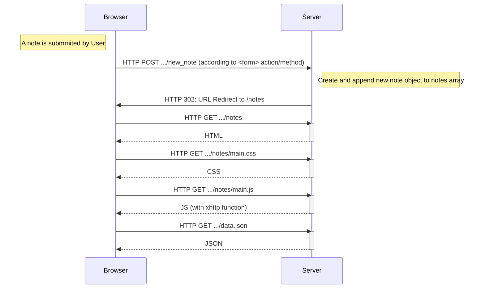

```mermaid
sequenceDiagram
Note left of Browser: A note is submmited by User
Browser->>Server: HTTP POST .../new_note (according to <form> action/method)
Note right of Server: Create and append new note object to notes array
Server->>Browser: HTTP 302: URL Redirect to /notes
Browser->>Server: HTTP GET .../notes
activate Server
Server-->>Browser:HTML
deactivate Server
Browser->>Server: HTTP GET .../notes/main.css
activate Server
Server-->>Browser:CSS
deactivate Server
Browser->>Server: HTTP GET .../notes/main.js
activate Server
Server-->>Browser:JS (with xhttp function)
deactivate Server
Browser->>Server: HTTP GET .../data.json
activate Server
Server-->>Browser:JSON
deactivate Server
```
