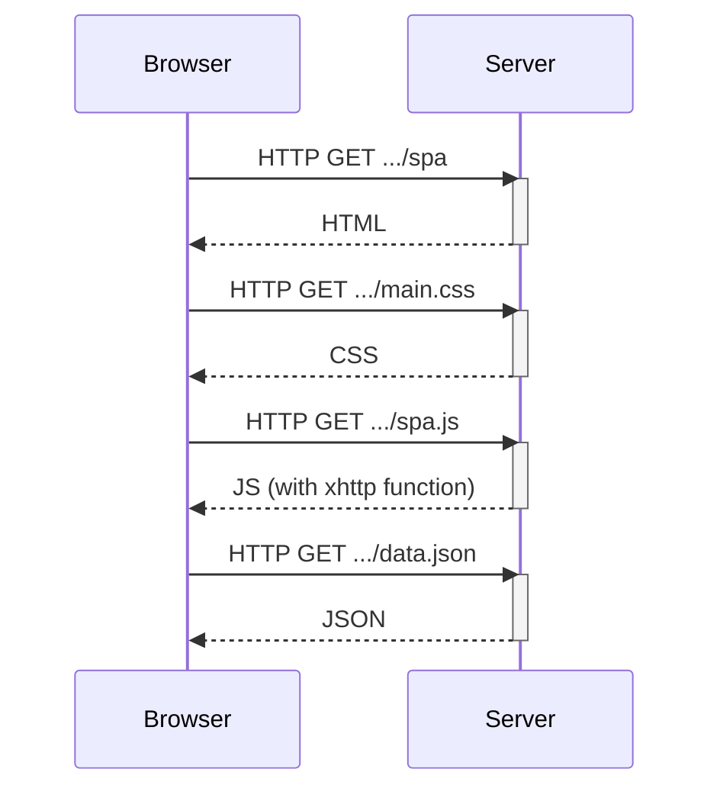

```mermaid
sequenceDiagram
Browser->>Server: HTTP GET .../spa
activate Server
Server-->>Browser:HTML
deactivate Server
Browser->>Server: HTTP GET .../main.css
activate Server
Server-->>Browser:CSS
deactivate Server
Browser->>Server: HTTP GET .../spa.js
activate Server
Server-->>Browser:JS (with xhttp function)
deactivate Server
Browser->>Server: HTTP GET .../data.json
activate Server
Server-->>Browser:JSON
deactivate Server

```
